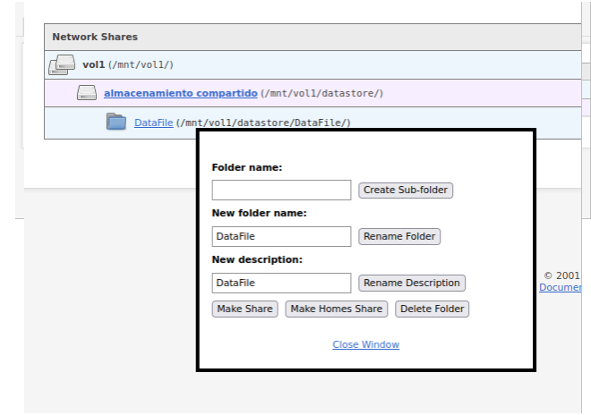
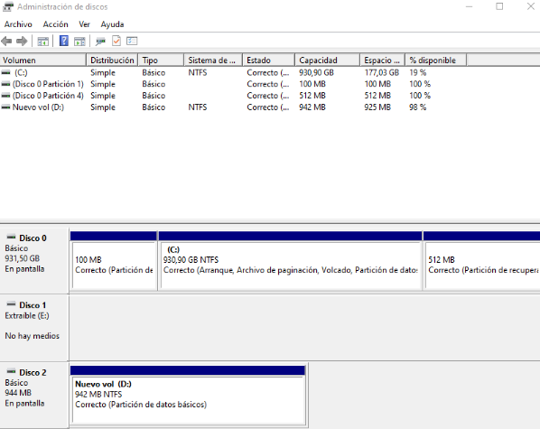

# Información básica de herramientas
## Clonezilla - Copia de seguridad y clonación de discos

Clonezilla es una herramienta de código abierto utilizada para la clonación de sistemas operativos, particiones y la creación de copias de seguridad de datos en sistemas informáticos. Esta basado en Linux, ofrece un conjunto de características sólidas que la hacen ideal para una variedad de situaciones, desde la replicación de sistemas hasta la recuperación de datos y la migración de sistemas.

## Características Principales

- **Clonación de Disco:** Clonezilla permite la creación de copias exactas de discos duros o particiones en otros discos o imágenes de disco. Esto es esencial para replicar sistemas o realizar copias de seguridad completas.

- **Manual de uso:** Clonecilla se usa por terminal asi que es necesario conocimientos basicos de consola, el manual de se puede consultar [Visita el sitio web de Clonezilla](https://clonezilla.org/clonezilla-live-doc.php)

- **Enlace de descarga:** [Visita el sitio web de Clonezilla](https://clonezilla.org/)

- **Aplicacion:** Clonezilla es perfecto para mantener copias de seguridad de sistemas operativos y restaurarlas cuando sea necesario y manteniendo las configuraciones guardadas en la copia.

- **Licencia de Código Abierto:** Clonezilla es software de código abierto distribuido bajo la Licencia Pública General de GNU (GNU GPL), lo que significa que es gratuito y personalizable.

- **Otros aspectos:**
*Soporte para Diversos Medios de Almacenamiento
*Múltiples Modos de Clonación
*Compresión de Imágenes
*alta Compatibilidad de Hardware
*Comunidad Activa

# Amanda Network Backup - Solución de Respaldo en Red

Amanda, o Advanced Maryland Automatic Network Disk Archiver, es una solución de respaldo en red de código abierto que se utiliza para realizar copias de seguridad y restaurar datos en sistemas y redes de computadoras. Esta herramienta de respaldo proporciona una forma efectiva de gestionar copias de seguridad en entornos empresariales y de redes.

## Características Principales

- **Copia de Seguridad en Red:** Amanda permite la realización de copias de seguridad en sistemas y dispositivos a través de una red, lo que es útil para entornos de red distribuida.

- **Programación Flexible:** Ofrece programación flexible para la ejecución de copias de seguridad automáticas en momentos específicos, lo que garantiza la protección regular de datos.

- **Gestión de Dispositivos de Almacenamiento:** Amanda es compatible con una variedad de dispositivos de almacenamiento, incluyendo unidades de cinta, discos duros, y almacenamiento en la nube.

- **Compresión y Encriptación:** Proporciona opciones de compresión y encriptación para proteger los datos de copia de seguridad durante la transferencia y el almacenamiento.

- **Supervisión y Notificaciones:** Ofrece funciones de supervisión para verificar el estado de las copias de seguridad y notificar sobre eventos importantes.

- **Recuperación de Datos:** Permite la restauración de datos desde copias de seguridad previamente creadas, lo que es esencial en caso de pérdida de información.

- **Escalabilidad:** Amanda es escalable y puede adaptarse a las necesidades de respaldo de pequeñas empresas hasta grandes corporaciones.
## Uso

- **Manual de uso:** Toda la documentación se puede consultar desde su sitio oficial [Visita el sitio web de Clonezilla](https://clonezilla.org/clonezilla-live-doc.php)

Amanda Network Backup es ampliamente utilizado por administradores de sistemas y equipos de TI que necesitan una solución de respaldo en red confiable y escalable. Esta herramienta es especialmente valiosa en entornos empresariales donde se deben respaldar y proteger grandes volúmenes de datos distribuidos en una red.

**Sitio Web del Proyecto:** [Amanda Network Backup](http://www.amanda.org/)

- **Otros aspectos:**
**Comunidad activa**
**Compatibilidad con sistemas operativos**
**Integración con el almacenamiento en la nube**
**Versiones gratuitas y comerciales**
**Comunidad Activa**
**Documentación Extensa**
# Acronis True Image - Solución de Respaldo y Recuperación de Datos

Acronis True Image es una potente solución de respaldo y recuperación de datos que ofrece protección avanzada para sistemas y datos críticos. Esta herramienta permite a los usuarios realizar copias de seguridad de sistemas completos, aplicaciones, archivos y configuraciones, así como recuperarlos de manera efectiva en caso de pérdida de datos o fallos del sistema.

## Características Principales

- **Copia de Seguridad Completa:** Acronis True Image permite realizar copias de seguridad de sistemas completos, discos duros, particiones, archivos y aplicaciones.

- **Recuperación Flexible:** Ofrece opciones de recuperación flexibles, incluyendo la posibilidad de restaurar sistemas en su totalidad o seleccionar archivos y carpetas específicos.

- **Protección en Tiempo Real:** Ofrece protección en tiempo real para evitar la pérdida de datos, incluyendo protección contra ransomware y otras amenazas.

- **Clonación de Disco:** Facilita la clonación de discos duros para migrar sistemas a nuevos dispositivos o unidades de almacenamiento.

- **Copia de Seguridad en la Nube:** Permite realizar copias de seguridad en la nube para garantizar la disponibilidad de datos desde cualquier ubicación.

- **Interfaz de Usuario Intuitiva:** La interfaz de usuario de Acronis True Image es fácil de usar, lo que facilita la configuración de copias de seguridad y restauración de datos.

## Uso

Acronis True Image es utilizado tanto por usuarios individuales como por empresas para proteger datos críticos y sistemas. Ejemplos de uso incluyen:

- Realizar copias de seguridad de sistemas completos antes de realizar actualizaciones o cambios importantes.

- Proteger datos importantes contra pérdida accidental o ataques de malware.

- Restaurar sistemas y datos en caso de fallos del sistema o pérdida de datos.

- Migrar sistemas a nuevos dispositivos o unidades de almacenamiento.

## Enlaces

- **Página Oficial de Acronis True Image:** [Sitio Oficial](https://www.acronis.com/)

- **Documentación Oficial:** [Documentación](https://www.acronis.com/en-us/support/documentation/)

## Otros Aspectos

- **Disponibilidad de Versiones Gratuitas y Comerciales:** Acronis True Image ofrece versiones de prueba gratuitas, así como ediciones comerciales con características adicionales.

- **Soporte Técnico:** La empresa ofrece soporte técnico y recursos de ayuda para los usuarios de Acronis True Image.

- **Compatibilidad de Plataformas:** La herramienta es compatible con una amplia gama de sistemas operativos y plataformas de hardware.

- **Encriptación y Seguridad:** Ofrece opciones de encriptación y seguridad para proteger los datos de copia de seguridad.

## Ejemplo de Uso

la empresa pepe es una empresa que presta sercicios de consultoria y necesita proteger sus datos criticos, como es asi utilizan el programa para realizar copias 
- copia de seguridad regular de datos empresariales
- Imagen de sistema completa
- Recuperación de desastres

## 2. Analiza y describe los sistemas biométricos que actualmente se están utilizando, así como los estudios de implantación de nuevas tecnologías respecto a este campo.

Los sistemas biométricos son una forma avanzada de autenticación e identificación que se basa en características únicas de las personas. Actualmente, se utilizan una variedad de sistemas biométricos y se están realizando investigaciones para mejorar y ampliar sus aplicaciones.

### Tipos de sistemas biométricos
1. **Rasgos Fisiológicos:** Estos incluyen huellas dactilares, geometría de la mano/dedo, iris, ADN, etc.
2. **Rasgos del Comportamiento:** Estos comprenden la voz, la firma, etc.

### Sistemas biométricos
1. **Reconocimiento de huellas dactilares:** Utiliza las características únicas de las huellas dactilares para la identificación.
2. **Reconocimiento facial:** Analiza características faciales para identificar a las personas.
3. **Reconocimiento de voz:** Se basa en patrones vocales para la autenticación.
4. **Reconocimiento de iris:** Escanea el patrón del iris del ojo para la identificación.
5. **Reconocimiento de venas de la palma:** Analiza las venas de la palma de la mano para la autenticación.
6. **Reconocimiento de escritura a mano:** Examina la escritura a mano para identificar a un individuo.
7. **Reconocimiento de ADN:** Utiliza el material genético para la identificación, aunque es menos común en aplicaciones cotidianas.

### Características de los sistemas biométricos
1. **Rendimiento:** Se refiere a la precisión del proceso de identificación. Los sistemas biométricos han mejorado en términos de precisión.
2. **Aceptabilidad:** La aceptación social y personal de los sistemas biométricos es importante. La comodidad y la percepción pública juegan un papel vital en su adopción.
3. **Evitabilidad:** La capacidad de eludir el sistema mediante procedimientos fraudulentos. Los sistemas biométricos deben ser resistentes a ataques como la suplantación de identidad.

### Estudios de implantación de nuevas tecnologías
- Continúan surgiendo avances en la precisión y la seguridad de los sistemas biométricos.
- La implantación de sistemas biométricos en dispositivos móviles y aplicaciones de la vida cotidiana está en constante crecimiento.
- Se están explorando aplicaciones en la atención médica, la banca y otros sectores.
- La regulación y la privacidad de los datos biométricos son temas importantes que se abordan a medida que se implementan nuevas tecnologías.

## Actividad 3.- Analiza el asistente/herramienta de copias de seguridad con el programador de tareas, restauración de las copias de seguridad, puntos de restauración, disco de reparación y reinicio del sistema en reparación/restauración en un entorno Windows 10 o windows server. Realiza el ejemplo pertinente que muestre la utilización de herramienta

En Windows 10 y Windows Server, puedes utilizar la herramienta de copias de seguridad integrada para programar y administrar copias de seguridad, realizar restauraciones, crear puntos de restauración, utilizar el disco de reparación y restaurar el sistema en situaciones de reparación. A continuación, te proporcionaré una descripción general de estas funcionalidades y un ejemplo de cómo usarlas.

Para crear una copia de seguridad en windows 10 lo primero que haremos es ir a la configuración (pulsando click derecho sobre el logo de windows)
en el panel que nos aparece pulsaremos en actualización y seguridad → copias de seguridad.

Ahora a copias de seguridad y restauración (windows 7) → creación de imagen de sistema. 

Ahora seleccionaremos los discos que van participar en la copia de seguridad.

También podemos seleccionar un medio extraible o una ubicación de red, en mi caso usare un disco duro.

    

ahora seleccionaremos las unidades de las que queremos que haga las copias

    

 y esperamos a que acabe

 

    

nos preguntara si queremos realizar un disco de reparación para el sistema (Esto nos posibilitara el iniciar un sistema operativo en caso de no poder iniciar nuestro sistema)

## 4. Cobain Backup
Cobian Backup es un software de copia de seguridad de datos diseñado para ayudar a los usuarios a respaldar y proteger sus archivos y carpeta.
Características:

- **Facil de usar**
- **Gratuito incluso en entorno comercial**
- **Buen rendimiento**
- **programación de copias**
- **se puede usar como servicio**
Realizaremos una copia de seguridad el con cobain,
Realizaremos la instalación de manera habitual como es normal en windows.
Para realizar una copia de seguridad lo primero que tenemos que hacer es ciclar en el símbolo “+” y configurarlo como queramos

    

en la siguiente ventana seleccionaremos la ubicación del origen y destino de la copia de seguridad

    

por ultimo nos mostrara todos los datos relevantes para hacer la copia y nos permitirá realizar la copia en cuanto le demos al botón de play azul (arriba a la izquierda).

durante la copia nos permite ver un log (a la derecha) en tiempo real informándonos de todas los evento que están ocurriendo hasta terminar nuestra copia de seguridad.

    

una vez realizada la copia podemos ver que el programa no solo nos ha creado la copia si no que le ha dado un nombre muy apropiado para identificar las copias.

    

Sin duda este programa es uno de los mejores para realizar copias de seguridad

## 5. Back4All
Esta aplicación es de pago por lo que tenemos varias opciones de inicio entre ellas
- **empezar la prueba**
- **introducir una clave de producto**
- **comprar**

    

el siguiente cuadro nos pide que seleccionemos el plan que queramos

    

cuando estemos en el panel principal solo tenemos que pinchar en la parte izquierda superior donde poen “NEW” 

    

en la siguiente pantalla vamos a seleccionar la el disco y carpeta donde vamos a guardar las copias

    

ahora seleccionamos la carpeta que queremos hacer una copia de seguridad

    

y confirmamos que queremos guardar

    

 y una vez le demos a save y acabe de copiar los archivos ya tendremos el backup para restaurarlo o subirlo a algún servicio de almacenamiento online

    

## 6. Configura y automatiza la copia de seguridad en un entorno linux de una estructura de directorios. Utiliza para ello el comando tar y el servicio crond – consideramos que la copia se realiza en el mismo equipo.

Primero he creado una estructura de directorios:

    

A continuación creo el script que se usará para crear el backup en otra carpeta de destino.

    

Después se le añaden permisos de ejecución con: **chmod +x backup_script.sh**

Podemos probar el script manualmente mediante **./backup.sh** lo que creará un archivo de respaldo en el directorio de destino indicado, en este caso “**Prueba_backup**”

Ahora podemos automatizar este proceso mediante el servicio cron, para ello modificamos el fichero crontab con **sudo nano /etc/crontab**

En este caso lo he programado para que se ejecute a las 10:10 de Lunes a Viernes, en el usuario usuario y señalando la ubicación del script.

    

Cuando llega la hora establecida, comprobamos que efectivamente nos crea el archivo

    

Podemos comprobar, extrayendo el archivo creado, que dentro está todo guardado correctamente.

    

## Actividad 7.-Configura y automatiza la copia de seguridad en un entorno linux de una estructura de directorios, considerando que la copia se realiza en otro equipo linux/windows (host remote).

Hacemos lo mismo que en el ejercicio anterior, pero cambiándolo para que se guarde también en otra máquina, para ello tenemos que tener otra máquina en la misma red.

    

Además, para que no pida contraseña al realizar el scp cuando se temporalice con el crontab, añadiremos la clave pública, para ello creamos una clave pública en la máquina remota con el comando: 

**ssh-keygen -t rsa**

y luego lo pasamos a la otra máquina con: 

**ssh-copy-id usuario@ip_del_servidor**

Además aquí se cambiaron los archivos /etc/hostname y /etc/hosts para poder conectar usando el nombre de la máquina, como podemos comprobar aquí, además de que ya no nos pide la clave para el ssh

    

Ya no tendremos problemas para cuando se ejecute el scp programado.

Modificamos el archivo crontab una vez más, en este caso se programa de lunes a viernes a las 13:25 las copias de seguridad.

    

Así quedó el script a ejecutar al final, mediante uso de nombre de máquina:

    

Ahora comprobamos que se ejecute correctamente con el crontab:

    

Ya funciona correctamente la copia de seguridad en otro dispositivo.

## 8. Analizar, implementa, configura en un entorno Windows la herramienta rsync.

Rsync es una herramienta de línea de comandos utilizada para la sincronización y copia de archivos de forma eficiente en sistemas Unix y Linux. Sin embargo, Rsync no es una herramienta nativa en Windows, por lo que para usarla en un entorno Windows, hay que realizar una serie de pasos que implican la instalación de software adicional.

Para esta práctica he usado la herramienta Cygwin.

Los pasos que he seguido son:

1. Descargar el instalador de Cygwin desde el sitio web oficial: https://www.cygwin.com/.

2. Ejecutar el instalador descargado.

3. En la primera pantalla del instalador, seleccionar "Install from internet" y hacer clic en "Next".

4. Elegir la ubicación donde se desea instalar Cygwin y establecer el directorio de instalación. El directorio por defecto es "C:\cygwin64". Luego, hacer clic en "Next".

5. En la pantalla "Select Local Package Directory", se puede elegir dónde guardar los paquetes temporales descargados. Dejar el valor predeterminado y haz clic en "Next".

6. A continuación, se debe elegir un servidor de espejo para descargar los paquetes. Dejar la opción predeterminada seleccionada y hacer clic en "Next".

7. En la pantalla "Select Packages," se mostrará una lista de paquetes disponibles. Se busca y selecciona los siguientes paquetes marcándose con un clic en la columna "Skip" y escoger la versión más reciente:

rsync: Busca "rsync" y marca la última versión.
openssh: Busca "openssh" y marca la última versión.

8. Después de seleccionar los paquetes, haz clic en "Next" y se iniciará la descarga e instalación de los paquetes seleccionados.

Una vez se instale, abrimos el terminal de Cygwin

    

Comprobamos que se han instalado correctamente.

    

Si  se desea configurar Rsync con opciones específicas o configurar un servidor Rsync, se tendrá que crear un archivo rsyncd.conf en tu sistema. Por ejemplo, se puede configurar una sincronización bidireccional o establecer reglas de exclusión.

Ahora, si ya tenemos la máquina Windows y otra máquina, en este caso usaré un Ubuntu y tienen conexión entre ellos, probaremos a enviarle algo:

    

Como podemos comprobar, ha pasado el archivo exitosamente.

Ahora probaremos a hacerlo a la inversa, a copiar un archivo de Ubuntu a Windows.

    

Se completa satisfactoriamente la transferencia de archivos y vemos que se ha enviado correctamente.

## 9. Analizar, implementa, configura en un entorno linux la herramienta rsync.

Para esta práctica, utilizaré el script de la copia de seguridad en otro dispositivo (ejercicio 7) y lo usaré con el rsync.

Simplemente cambio la línea de scp por la nueva de rsync y queda así:

    

Ejecutamos el script:

    

Y efectivamente, en la máquina remota se crea el backup de la misma forma.

    

## 10. Configura y automatiza la copia de seguridad en un entorno linux de una estructura de directorios. Utiliza para ello el comando dd y el servicio crond – consideramos que la copia se realiza en el mismo equipo-. Considerar distintos programas de copia, cada uno de ellos con sus correspondientes momentos.

Para este ejercicio, he añadido un disco duro de 200MiB para realizar una copia de seguridad de disco, para ello se le engancha el disco duro al VirtualBox y le di una tabla de particiones gpt y cree una partición primaria con el disco (usando GParted).

Después de tener el nuevo /dev/sdb creé un script para la automatización de la copia de seguridad del disco.

    

Con eso nos creará la copia de seguridad en la ubicación y el nombre seleccionados, donde pondrá la fecha de la copia de seguridad.

Aquí hago una prueba manual de la ejecución y comprobamos que se crear correctamente la copia de seguridad.

    

Ya que el script contiene líneas con sudo, a la hora de configurar el crontab pondré como usuario root, para que cree sin problema el archivo, de otra manera no lo crearía.
Quedaría de esta manera, en esta ocasión lo he programado para que se ejecute a las 22:15 todos los días.

    

Como podemos comprobar, de esta manera automatizará bien el backup.

    

## 11. Investigar sobre AWS backup.

**Características de AWS Backup**

AWS Backup es una solución de gestión de respaldo de datos que ofrece una serie de características clave para garantizar la protección y disponibilidad de datos en entornos en la nube de AWS. Algunas de las características son:

**Gestión Centralizada:** AWS Backup permite la gestión centralizada de respaldos para múltiples servicios de AWS, lo que simplifica la administración de respaldos en un entorno diverso.

**Políticas de Respaldo:** Los administradores pueden definir políticas de respaldo personalizadas para cada servicio, lo que permite una mayor flexibilidad en la programación y retención de respaldos.

**Automatización:** AWS Backup ofrece programación automatizada de respaldos, lo que reduce la carga de trabajo manual y garantiza la coherencia en la ejecución de respaldos.

**Restauración Flexible:** Los datos respaldados se pueden restaurar de manera selectiva, lo que permite recuperar elementos específicos en lugar de restaurar todo el conjunto de datos.

**Auditoría y Cumplimiento:** AWS Backup registra las actividades de respaldo y proporciona información detallada sobre quién accede a los datos respaldados, lo que facilita el cumplimiento de regulaciones y políticas de seguridad.

**Comparación con Otras Soluciones de Respaldo**
En comparación con otras soluciones de respaldo en la nube y en las instalaciones, AWS Backup presenta ventajas significativas. La capacidad de gestionar respaldos de múltiples servicios de AWS en un solo lugar y la integración nativa con otros servicios de AWS son ventajas clave. Además, AWS Backup se beneficia de la infraestructura y la seguridad robusta de AWS.

Sin embargo, es importante señalar que AWS Backup puede no ser la solución óptima para todas las necesidades de respaldo. En algunos casos, soluciones especializadas pueden ofrecer características más avanzadas y precisas.

## 12. Configura y automatiza la copia de seguridad en un entorno linux de una estructura de directorios. Utiliza para ello el comando duplicity y el servicio crond – consideramos que la copia se realiza en el mismo equipo-.

Lo primero que hay que hacer es generar una clave gpg, aquí la creo yo:

    

Después de generar la clave, vemos la id de nuestra clave, la podemos ver mediante el siguiente comando:

    

Copiamos lo señalado y luego creamos el script y usamos el id:

    

Una vez lo tengamos hecho el script le damos permisos de ejecución con:

**sudo chmod +x backup_duplicity.sh**

Luego probamos la ejecución manual, y comprobamos que no haya errores.

    

Aquí comprobamos que se ha creado.

    

Ahora para automatizarlo añadimos la sentencia oportuna al crontab.

    

Aquí comprobamos que se crea el backup a la hora estimada.

    

    

## 14. Explica y ejercita las opciones más importantes de la herramienta de clonación Clonezilla. vamos a realizar una clonación de un disco con nuestro clonezilla, para ello vamos a iniciar el ordenador utilizando clonezilla como boot y seleccionaremos la primera opción de clonezilla live.

Nos preguntara si queremos usar clonezilla o poner el login de shell, utilizaremos la opción (start_clonezilla)

    

en la siguiente pantalla usaremos la opción de clonación en nuestro caso usaremos device-image (de disco a imagen)

    

antes de clonar tendremos que indicar que método usar, en mi caso voy a usar un servidor de red SMB.
nos preguntará que ip usaremos, yo le daré dhcp, y a continuación nos pedirá la dirección del servidor o hostname en mi caso usare el hostname.

    

luego nos preguntara por el dominio en el caso de tenerlo (dejar en blanco si no lo tenemos)

A continuación nos pedirá donde vamos a guardar la imagen en árbol de directorios en mi caso sera este
también nos pedirá el usuario que tenga permisos para escribir. 
después nos preguntara que protocolo SMB vamos a usar, yo lo dejare que ambas maquinas se pongan de acuerdo (auto)

    

nos preguntara por el modo de seguridad usaremos por defecto

    

Y una vez que hayamos introducido todos los datos nos pedirá la contraseña y empezara la clonación

    

una vez comprobamos que todo sea correcto le damos “intro” para continuar
ahora nos preguntara en que modo hacerlo, yo usare principiante

    

ahora seleccionaremos que guardar en mi caso el disco completo

    

luego pondremos el nombre que queramos a la imagen (nos siguiere uno aceptable pero no perfecto)

    

ahora pondremos los discos que van a ser clonados

    

también nos permite usar la compresion z1p o z9p, usare la z1p
a continuación nos permite usar la reparación del sistema de archivos o por el contrario omitir este paso.

también nos permitirá comprobar la imagen y cifrar la imagen.
Y nos permitirá elegir que hacer cuando acabe la clonación

    

y solamente tendremos que dejar que acabe la clonación.

## 20. instalación de ubuntu con raid
Vamos a realizar una instalación de ubuntu junto con la configuración de un raid 1

realizaremos una instalación de manera habitual hasta que lleguemos a este apartado en el que seleccionaremos la ultima opción (custom storage layout)

    

ahora le daremos a  create softaware raid (md)

    

en esta pantalla rellenaremos los datos a nuestro gusto, en mi caso voy a llamarlo miraid1 y voy a usar raid1 con las 2 particiones que tengo (es extremadamente aconsejable usar particiones o discos del mismo tamaño)

una vez tengamos las particiones y el raid como lo necesitemos o queramos le damos ha hecho y continuamos con la instalación.

    

una vez que acabe el proceso de instalación

    

y ya tenemos el raid creado

## 21. Instalación y puesta en marcha de un sistema de almacenamiento compartido NAS. Utilizar Openfiler.
Openfiler es una distribución de almacenamiento de código abierto que proporciona soluciones de almacenamiento en red (NAS) y almacenamiento de área de almacenamiento en red (SAN) para entornos empresariales y de servidores. Ofrece una variedad de características, incluyendo la administración de dispositivos de almacenamiento, protocolos de compartición de archivos (SMB, NFS, FTP), acceso a través de la web y herramientas de administración avanzada para configurar y administrar sistemas de almacenamiento en red. Openfiler es una opción versátil y escalable para crear soluciones de almacenamiento de datos compartidos en una red local o entorno empresarial.

Las credenciales del usuario administrador por defecto son openfiler y password

lo primero que haremos es activar el servicio nfs simplemente en la pestaña servicios.

    

ahora vamos a crear una red de acceso para departamentos y configuramos una red y un nombre

    

lo siguiente sera crear un volumen para compartir en volumen → add volumen

    

ahora crearemos un bloque de almacenamiento en este volumen

    

ahora iremos a shares para configurar la configuracion de directorios compartidos y crearemos un directorio

    

y le daremos a make share
ya solo falta darle acceso publico y actualizarlo

    

## 22. Instalación y puesta en marcha de un sistema de almacenamiento compartido SAN. Utilizar Openfiler.
Lo primero de todo será instalar una máquina openfiler, que una vez la tengamos y la pongamos en marcha nos aparecerá lo siguiente, donde copiaremos el enlace con su ip.

    

Una vez copiemos el enlace y lo pongamos en un navegador, en este caso mozilla firefox, ya que con google chrome no funcionaba, nos aparecerá el siguiente login, donde pondremos **usuario: openfiler** y **password: password.**

    

Primero nos vamos a System y en "network Access Configuration" creamos uno nuevo que se llamará SAN con la ip de nuestra red y la máscara.
Tenemos que tener un disco duro insertado en el openfiler para esta práctica.

Ahora creamos un grupo de volúmenes.

    

Después crearemos un volumen dentro de ese grupo que acabamos de crear.

    

Lo siguiente será en administrar servicios **"Manage Services"**, activaremos e iniciaremos el **"iSCSI Target"**.

    

Después en la pestaña de **"Volumes"**, a la derecha, pinchamos sobre **"iSCSI Targets"** y ahí añadiremos uno.

    

En la misma pestaña, nos vamos a **"LUN Mapping"** y una vez dentro, le daremos a map.

    

Ahora nos vamos, en la misma pestaña de nuevo a **"Network ACL"** y lo cambiaremos a **Allow** y después hacemos clic en **Update**.

    

Ahora en Windows, tendremos que buscar **iniciador iSCSI**, cuando lo abramos tendremos que ir a la pestaña **Detección**, le daremos a **Detectar portal...**, pondremos la dirección ip del openfiler y luego en **Opciones avanzadas...** el **adaptador local** lo pondremos como **Iniciador iSCSI de Microsoft** y la **IP de iniciador** seleccionaremos la **ip del Windows**.

    

Volvemos a la pestaña **"Destinos"** y ahí lo conectaremos.

    

Después de darle a **conectar**, le daremos a **Advanced** y cambiaremos de nuevo:
Adaptador local: **Iniciador iSCSI de Microsoft**
IP de iniciador: **"ip de Windows"**
IP del portal de destino: **"ip de openfiler / puerto"**

    

Ahora abrimos el administrador de discos con **diskmgmt.msc**.

    

Y le damos un formato al nuevo volumen del nuevo disco.

    

